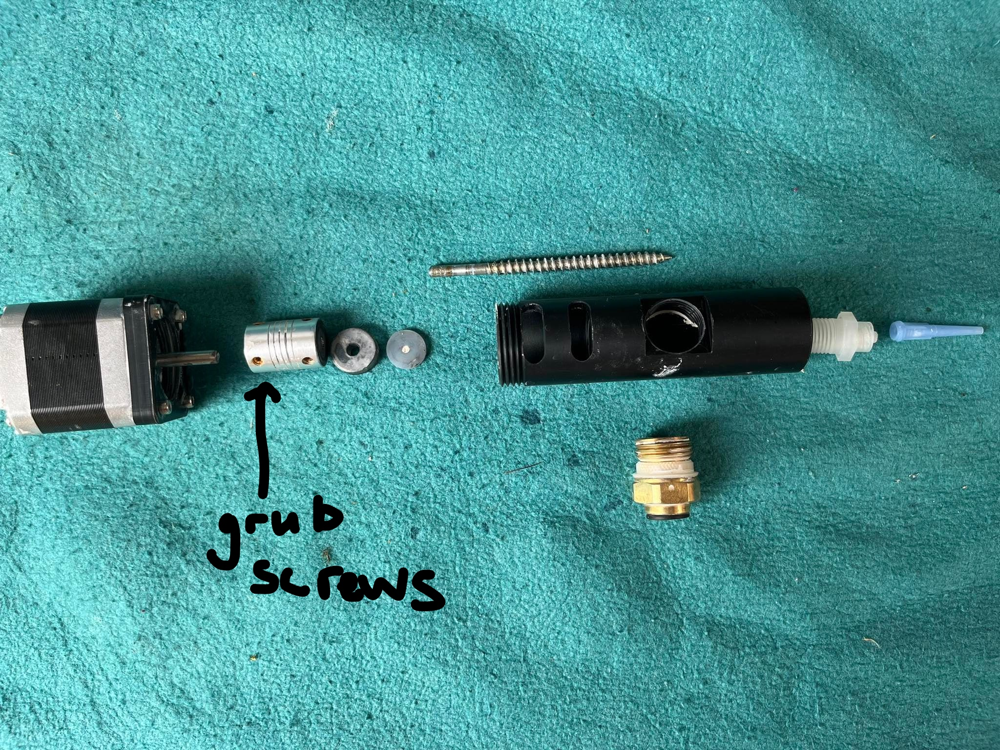
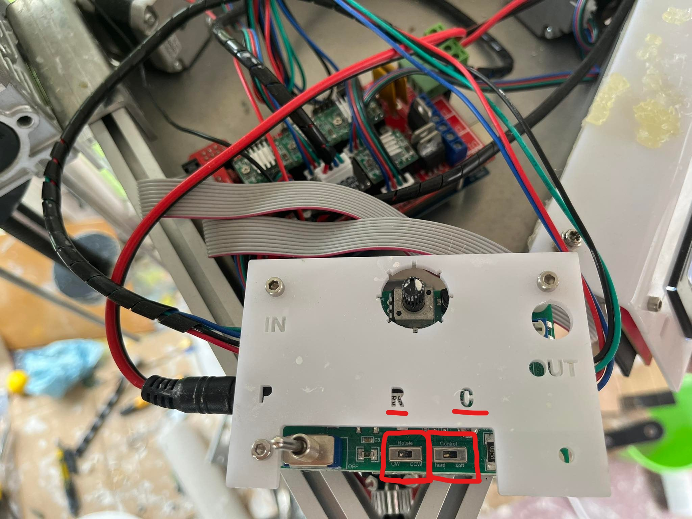
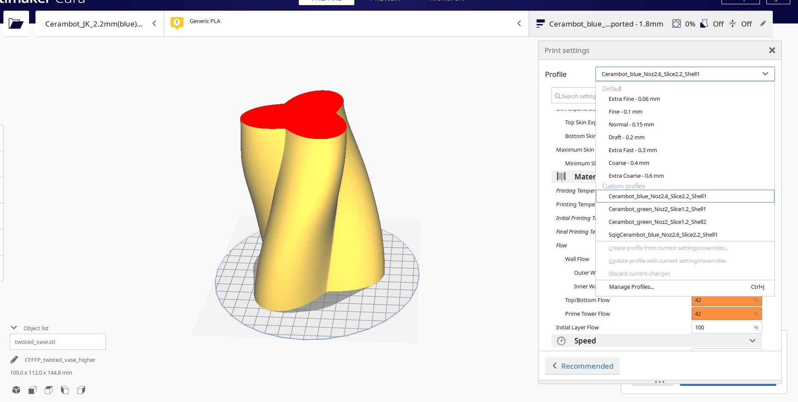
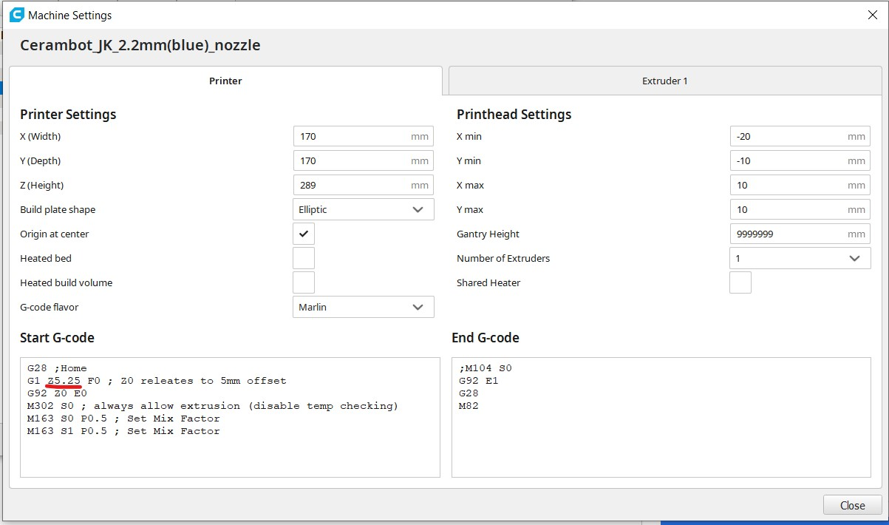
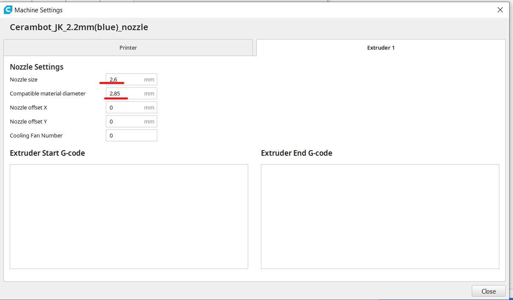
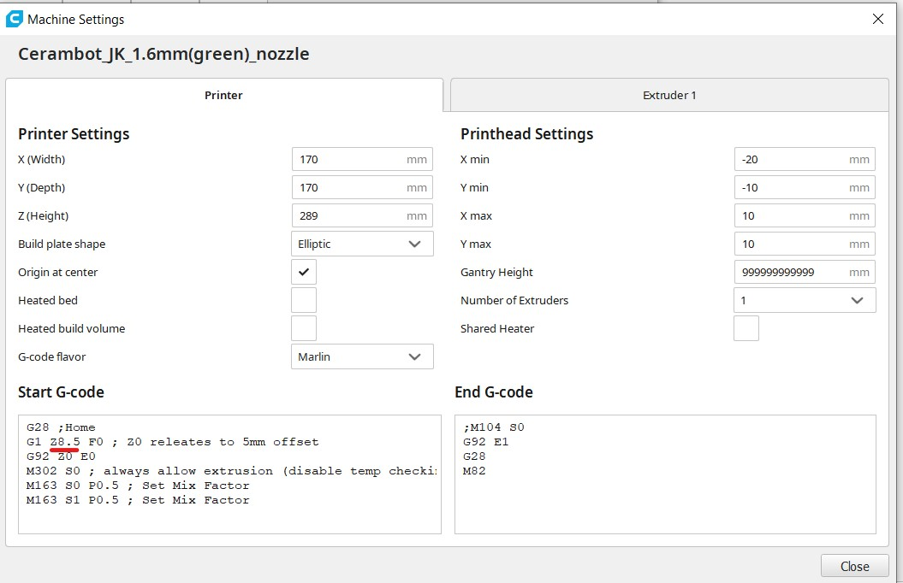
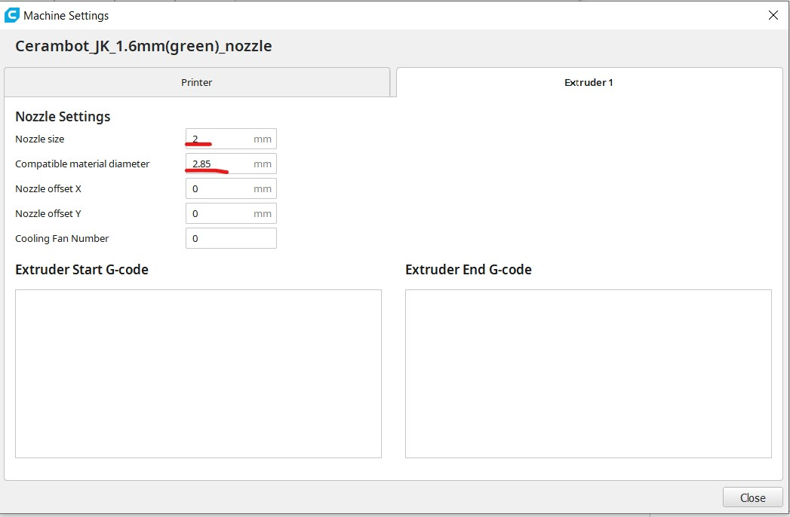

# Cerambot Instructions

- [Cerambot Instructions](#cerambot-instructions)
  - [Assembly](#assembly)
  - [Setup](#setup)
    - [Assembling Extrusion Nozzle](#assembling-extrusion-nozzle)
    - [Packing Clay](#packing-clay)
  - [Operations](#operations)
    - [Extrusion Pusher Controller](#extrusion-pusher-controller)
    - [Printing](#printing)
  - [Making Model for Printing](#making-model-for-printing)
    - [Designing Model](#designing-model)
    - [Slicing](#slicing)
      - [Blue Nozzle](#blue-nozzle)
      - [Machine Settings](#machine-settings)
      - [Profile Settings](#profile-settings)
      - [Green Nozzle](#green-nozzle)
      - [Machine Settings](#machine-settings-1)
      - [Profile Settings](#profile-settings-1)
  - [Common Problems](#common-problems)
    - [Printer moving slowly](#printer-moving-slowly)
    - [No Clay being extruded](#no-clay-being-extruded)

## Assembly 

Cerambot Assembly Instructions:

- https://www.cerambot.com/wp-content/uploads/2020/08/v1.4En20200803Cerambot-3.2.0User-Manual.pdf
- https://cerambot.com/wp-content/uploads/2020/02/CERAMBOT-Pro-Instruction-Manual.pdf

## Setup

### Assembling Extrusion Nozzle

After each print it is recommended to disassemble the extrusion nozzle to clean it. Image below indicates how the nozzle can be re-assembled. Futher documentation in links above

### Packing Clay

A good method is required to ensure air bubbles are not present in the clay. It was found packing a larger container full of clay, then inserting the PVC pipe into the clay worked well. 

## Operations

### Extrusion Pusher Controller

This board controls the main extrusion pusher motor. The two switches (R and C) control different aspects.

The **R** switch controls the direction of rotation:
- **CW** (clockwise) means the Extruder moves up
- **CCW** (counter-clockwise) means the Extruder moves down

The **C** switch controls what system moves the motor:
- **Hard** (hardware) refers to manual mode, the motor will move continuosly and the speed can be adjusted by the black dial
- **Soft** (software) refers to automatic mode, the motor will be controlled by the printer itself. **Note** it must be in soft mode for printing 

### Printing

## Making Model for Printing 

To prepare a model for printing, first a 3D model/mesh needs to be designed, then "sliced" (converted into g-code for the printer to follow)

### Designing Model

There are a number of methods for designing the 3D model/mesh.

Based off this tutorial playlist by Jonathon Keep, blender has been predominately used to design the 3D models - [1. Blender 2.91 - Introduction](https://www.youtube.com/watch?v=mJLemUhaOhs&list=PLD_uR9vw07u_UHrYtAP1YTZXoTKHUP5T9)

Other alternatives include:
- Solidworks
- Fusion360
- MeshMixer

### Slicing

To convert the model into g-code for the printer, again there are a few slicing programs.

Again, based off another tutorial by Jonathon Keep, and the Cerambot instructions, Cura is recommended - [Ultimaker Cura - Slicing for Clay or Ceramic 3D Printing](https://www.youtube.com/watch?v=sS6RdKzGirQ)

The Cura slicing settings (and machine settings) can change quite regularly depending on the nozzle, print size, desired wall thickness etc.

For each new profile, you may need to adjust the machine settings:

Or the Profile Settings:

Some good default settings are:

#### Blue Nozzle

The blue nozzle is around 2.2mm thick
#### Machine Settings

**Note** - Red underline changes depending on height of base being printed to

**Note** - Nozzle size and copatiable material diameter larger than real nozzle size (real sizes found on Cerambot site)

#### Profile Settings

Recommended to use ``cura/blue_nozzle.curaprofile`` settings

#### Green Nozzle

The blue nozzle is around 1.6mm thick
#### Machine Settings

**Note** - Red underline changes depending on height of base being printed to

**Note** - Nozzle size and copatiable material diameter larger than real nozzle size (real sizes found on Cerambot site)

#### Profile Settings

Two profiles were generated for the green nozzle:
- ``cura/green_nozzle_1_wall.curaprofile`` - prints only a single wall
- ``cura/green_nozzle_2_wall.curaprofile`` - prints two walls 

## Common Problems

Some of the most common problems when printing

### Printer moving slowly 

This was noticed to happen after a print was cancelled. Removing power to the printer, then repowering was found to fix this problem.

### No Clay being extruded

This happens either because:
-  The Extruder Pusher (motor pushing clay) hasn't had enough time to push clay through the system - this just requires more time, keep printing untill clay flowing normally, then restart print
- The Extruder Pusher is not on (happens more often than you'd think)
